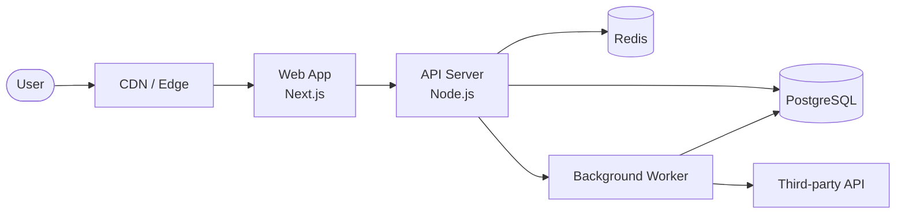
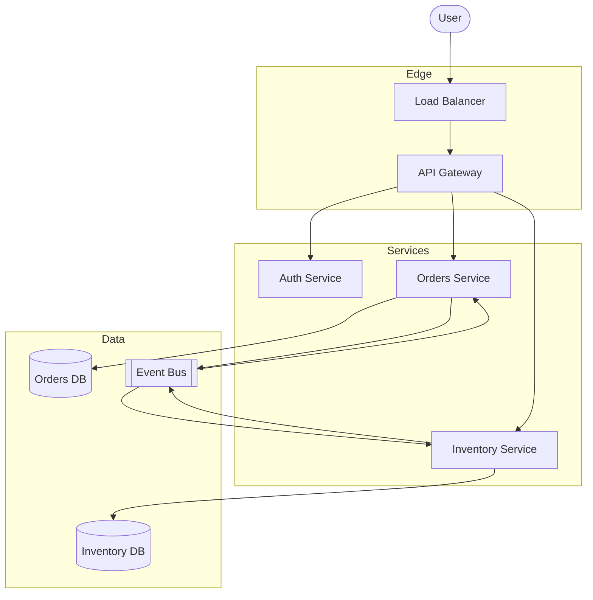
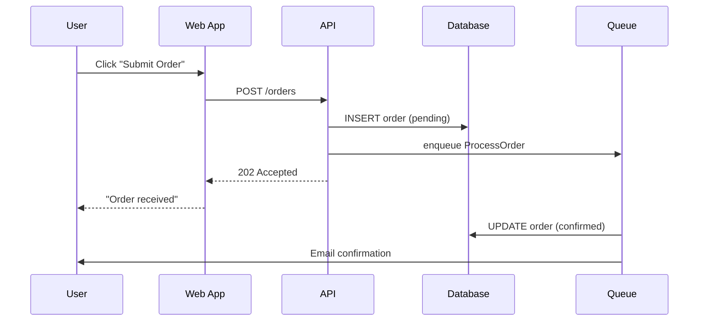
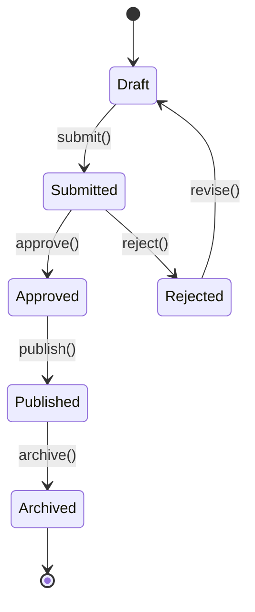
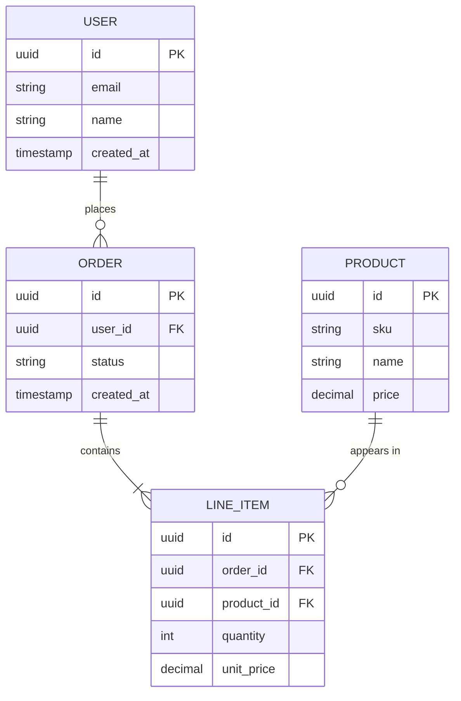
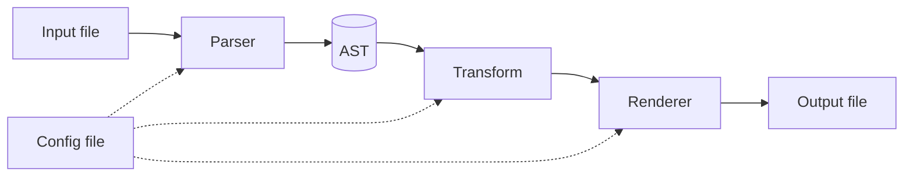
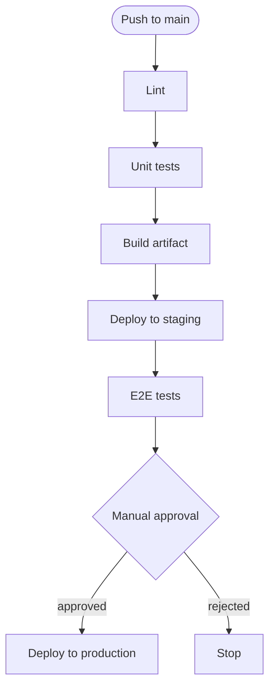

# Mermaid examples for README diagrams

Pick the diagram type that matches what you're trying to communicate. The patterns below are starting points — adapt names, arrows, and styling to the project.

## 1. Web app architecture (flowchart)

Use when showing how a typical web/service architecture fits together.

## 2. Microservices / event-driven (flowchart with subgraphs)

Use when components group naturally into bounded contexts.

## 3. Request lifecycle (sequence diagram)

Use when the *order of operations* matters more than the components.

## 4. State machine (stateDiagram)

Use when the project's core entity has a non-trivial lifecycle.

## 5. Data model (ER diagram)

Use for libraries or apps where the schema is the story.

## 6. CLI / library data flow (flowchart, simpler)

Use for CLI tools, libraries, or build pipelines.

## 7. CI/CD pipeline (flowchart top-to-bottom)

Use when documenting how code gets to production.

## Styling tips

- Keep the diagram **small enough to read on a phone** — if it sprawls, split it into two diagrams.
- Use `[(Database shape)]` for data stores, `([Round shape])` for actors/users, `[[Subroutine shape]]` for queues/buses, plain `[Rectangle]` for services.
- Prefer `LR` (left-to-right) for request flows, `TB` (top-to-bottom) for pipelines and hierarchies.
- Don't show every component. The diagram should highlight the parts a reader needs to understand the system; details belong in deeper docs.
- If one path is the "happy path," draw it with solid arrows and put failure / async paths in dotted (`-.->`).
