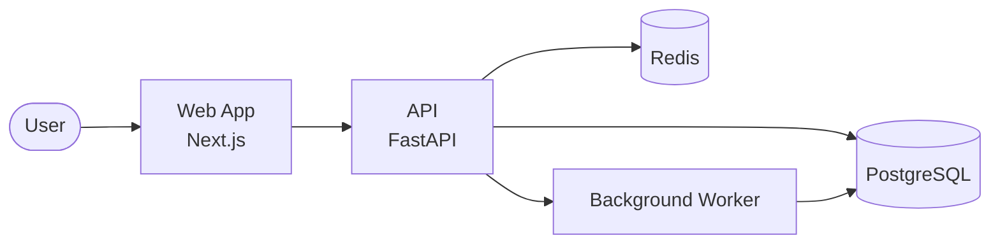

# {{Project Name}}

> {{One-sentence pitch: what this project does and who it's for.}}

<!-- Optional: badges, logo, hero screenshot, demo link.
     Examples:
     
     
     [Live demo]({{demo-url}}) · [Documentation]({{docs-url}})
-->

---

## Table of Contents

- [About](#about)
- [Features](#features)
- [Tech Stack](#tech-stack)
- [Architecture](#architecture)
- [Project Structure](#project-structure)
- [Getting Started](#getting-started)
- [Configuration](#configuration)
- [Security](#security)
- [How to Contribute](#how-to-contribute)
- [What's Next](#whats-next)
- [License](#license)
- [Acknowledgements](#acknowledgements)
- [Author](#author)

---

## About

{{Two or three short paragraphs: what the project is, what problem it solves, who it's for, and at a high level how it works. No implementation details — those come later.}}

---

## Features

{{Pick one of the two layouts below. Delete the other.}}

**Table layout (best for \~3-7 features):**

| Feature | Description |
| - | - |
| {{Feature 1}} | {{One-line description}} |
| {{Feature 2}} | {{One-line description}} |
| {{Feature 3}} | {{One-line description}} |

**Subheading layout (best when each feature needs more explanation):**

### {{Feature 1}}

{{1-2 sentences. Stay at the level of *what it does*, not *how it works*.}}

### {{Feature 2}}

{{1-2 sentences.}}

---

## Tech Stack

- **Language:** {{e.g., TypeScript 5.x, Python 3.12, Go 1.22}}
- **Framework:** {{e.g., Next.js 14, FastAPI, Gin}}
- **Database:** {{e.g., PostgreSQL 16, SQLite, Redis}}
- **Infra:** {{e.g., Docker, AWS ECS, Cloudflare Workers}}
- **Notable libraries:** {{e.g., Drizzle ORM, Pydantic, Zod}}
- **Tooling:** {{e.g., pnpm, ruff, golangci-lint}}

---

## Architecture

{{Replace this Mermaid diagram with one that reflects your actual system. See `mermaid-examples.md` in this skill for more patterns.}}



{{One short paragraph describing the flow: what each component does, how requests move through the system, where state lives. Keep it to what the diagram doesn't already show.}}

---

## Project Structure

```
{{project-name}}/
├── src/                  # Application source code
│   ├── api/              # HTTP handlers and routing
│   ├── domain/           # Business logic, types, entities
│   ├── infra/            # External integrations (DB, queue, third-party APIs)
│   └── ui/               # Frontend components and pages
├── tests/                # Unit and integration tests
├── scripts/              # Dev/CI/deployment scripts
├── docs/                 # Extended documentation
├── .env.example          # Template for required environment variables
├── docker-compose.yml    # Local dev stack
└── README.md
```

---

## Getting Started

### Prerequisites

- {{e.g., Node.js 20+}}
- {{e.g., Docker and Docker Compose}}
- {{e.g., A `.env` file (copy from `.env.example`)}}

### Install

```bash
git clone https://github.com/{{owner}}/{{repo}}.git
cd {{repo}}
{{install command, e.g., pnpm install}}
```

### Run locally

```bash
cp .env.example .env
{{any required setup, e.g., docker compose up -d postgres}}
{{run command, e.g., pnpm dev}}
```

The app should be available at `http://localhost:{{port}}`.

### Run the tests

```bash
{{e.g., pnpm test}}
```

> **Verify these steps yourself before publishing.** Missing one detail here is the most common reason a contributor gives up.

---

## Configuration

| Variable | Required | Default | Description |
| - | - | - | - |
| `DATABASE_URL` | yes | — | Postgres connection string |
| `REDIS_URL` | yes | — | Redis connection string |
| `LOG_LEVEL` | no | `info` | One of `debug`, `info`, `warn`, `error` |
| `PORT` | no | `3000` | HTTP port the server binds to |
| `{{ANOTHER_VAR}}` | {{yes/no}} | {{default}} | {{description}} |

See `.env.example` for the canonical list.

---

## Security

- **Secrets:** never commit `.env`. Production secrets live in {{your secret manager}}.
- **Auth model:** {{e.g., session cookies issued by API, validated on every request}}.
- **Threat model:** {{a sentence or two about what you're defending against and what's out of scope}}.
- **Reporting vulnerabilities:** see `SECURITY.md`, or email {{security-contact}}.

When adding new features, follow the existing patterns for input validation, authorization checks, and secret handling. Don't bypass them "temporarily."

---

## How to Contribute

1. Fork the repo and create a feature branch from `main`.
2. Run the test suite locally and make sure it passes.
3. Open a pull request describing the change. Reference the issue it closes if applicable.
4. A maintainer will review within {{timeframe}}.

Commit messages follow {{convention, e.g., Conventional Commits}}. Code style is enforced by {{linter}}; run `{{lint command}}` before pushing.

For bigger changes, open an issue first to discuss the approach.

---

## What's Next

Planned work, in rough priority order:

- [ ] {{Upcoming feature 1}}
- [ ] {{Upcoming feature 2}}
- [ ] {{Tech debt item}}
- [ ] {{Quality-of-life improvement}}

Suggestions and contributions on any of these are welcome.

---

## License

<!--
DEFAULT for this user: Polyform Shield 1.0.0 (non-standard, source-available — NOT OSI-approved).
Use the block below verbatim unless the user has explicitly named a different license.
If a non-Polyform license is in play, keep the structure: name + plain-English summary of constraints.
Never ship the bare "Licensed under X — see [LICENSE] for details" line.
-->

Released under the [Polyform Shield License 1.0.0](LICENSE). Source-available, not open-source — read the license before you build a paid SaaS on top of it.

- **You can:** use it, fork it, learn from it, ship it inside your day job, hand it to a client.
- **You can't:** sell it, rebrand it, host it as paid SaaS, or otherwise monetize it without explicit written permission.
- **Public forks:** include the LICENSE file and credit the original work.

---

## Acknowledgements

- {{Library or framework that did the heavy lifting}}
- {{Person, project, or article that inspired this}}
- {{Contributors who shaped the design}}

---

## Author

**{{Your Name}}**

- GitHub: [@{{handle}}](https://github.com/{{handle}})
- Website: {{url}}
- Email: {{email}}

Open to questions, feedback, and collaboration.
