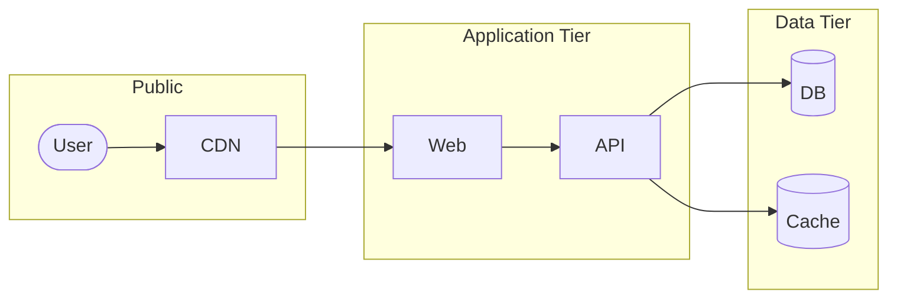

# Mermaid diagram type selection guide

Use this guide to pick the right Mermaid diagram type for the Architecture section (and anywhere else you reach for a diagram in the README).

## Decision rules

Ask: **what is the diagram trying to show?**

| You want to show… | Use |
| - | - |
| Components and how data/requests flow between them | `flowchart` |
| The sequence of messages between actors over time | `sequenceDiagram` |
| The lifecycle of a single entity (states + transitions) | `stateDiagram-v2` |
| The data model / database schema | `erDiagram` |
| A pipeline (CI/CD, build, ETL) with linear-ish stages | `flowchart TB` |
| Class hierarchies in an OO codebase | `classDiagram` |
| User journey through a product | `journey` |
| Project plan / Gantt chart | `gantt` |
| Pie chart of categorical breakdown | `pie` |

## Default for "Architecture"

For most service-shaped projects (web app, API + workers + DB, microservices), default to **`flowchart LR`** (left-to-right). This gives you the typical "request enters from the left, traverses the system, hits the database on the right" reading order that matches how people mentally model HTTP traffic.

For pipelines, builds, or anything where progress is the point, use **`flowchart TB`** (top-to-bottom).

## Shapes by component type

Pick shapes that match what each component *is*, not just to add visual variety.

| Shape syntax | Use for |
| - | - |
| `[Service Name]` | Services, applications, generic boxes |
| `([User])` | External actors, users, clients |
| `[(Database)]` | Databases, persistent stores |
| `[[Queue]]` | Queues, message buses, subroutines |
| `>Note]` | Annotations, side comments |
| `{Decision?}` | Branching logic in pipelines |

## Arrow styles

| Syntax | Means |
| - | - |
| `-->` | Synchronous call / hard dependency |
| `-.->` | Async, optional, or fallback path |
| `==>` | Emphasized / primary path |
| `--x` | Failure or terminating path |

Use the visual difference deliberately — e.g., the happy path in solid lines, the async/event-driven side paths in dotted.

## Subgraphs (grouping)

Use `subgraph` to group components by bounded context, deployment unit, or trust boundary. Don't overdo it; one to three subgraphs in a single diagram is plenty.



## When *not* to use Mermaid

Mermaid is the default but not the only option. Reach for something else when:

- **The system is too complex for any single diagram.** Split into multiple smaller diagrams or use a dedicated architecture-as-code tool (Structurizr / C4, Excalidraw exports). A 60-node Mermaid graph is unreadable.
- **The visual fidelity matters.** For published architecture posts, hand-drawn or designer-tooled diagrams may be worth the extra effort. A README typically isn't that.
- **The render target doesn't support Mermaid.** npm registry, PyPI, and some older Markdown viewers don't render Mermaid. Solution: keep the Mermaid source in the README, render it once to SVG, and check the SVG into the repo as a fallback.

## Render target compatibility

Confirmed Mermaid-native rendering:

- GitHub (since 2022)
- GitLab
- Bitbucket Cloud
- Gitea / Forgejo
- Most static site generators with a Mermaid plugin (Docusaurus, MkDocs, Hugo)
- VS Code Markdown preview

Does **not** render Mermaid:

- npm package page
- PyPI package page
- Some corporate wiki tools (Confluence native — needs a plugin)

## Quick troubleshooting

- **Diagram appears as a literal code block on GitHub** — make sure the fence is exactly ` ```mermaid ` with no extra characters, and that it's a `.md` file (not `.txt`).
- **Mermaid syntax error** — paste the diagram into [mermaid.live](https://mermaid.live) to get a clearer error message than GitHub gives.
- **Long node labels overflow** — use `<br/>` to wrap manually inside a label, or shorten the label and put the full description in the prose below.
- **Arrows crossing each other** — try changing direction (`LR` ↔ `TB`), or split into two diagrams.
